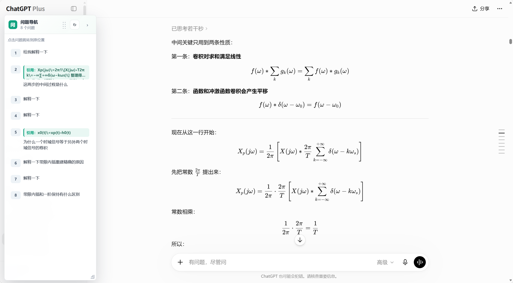

# ChatGPT Question Navigator

ChatGPT Question Navigator 是一个本地运行的 Chrome / Edge Manifest V3 浏览器扩展。它会在 ChatGPT 当前对话页面中生成“问题导航”侧边栏，自动列出当前对话里用户发送的问题，并支持点击后跳回对应提问位置。

这个扩展适合长对话、资料整理、论文学习、代码讨论和多轮追问场景，可以减少反复向上滚动查找历史问题的时间。

## 实际效果

## 功能

- 只在 `chatgpt.com` 和 `chat.openai.com` 页面注入脚本。
- 自动列出当前对话中用户发送的问题。
- 如果问题引用了 ChatGPT 回答中的文字，导航项会一起显示对应引用片段。
- 对“引用文字 + 我不明白 / 什么意思 / 解释一下”这类行内引用问题也会自动拆分显示。
- 点击问题即可跳转到原消息位置，并短暂高亮。
- 支持 ChatGPT 页面动态加载；捕获到新问题后增量追加，不会反复重建整个导航列表。
- 右侧悬浮导航栏可拖动、可缩放、可折叠。
- 自动记住导航栏的位置和尺寸，不上传对话内容。

## 安装方式

1. 打开 Chrome 或 Edge。
2. 进入 `chrome://extensions/` 或 `edge://extensions/`。
3. 开启“开发者模式”。
4. 点击“加载已解压的扩展程序”。
5. 选择本项目目录。
6. 打开或刷新 ChatGPT 页面。

## 使用方式

- 打开任意 ChatGPT 对话后，页面右侧会出现“问题导航”。
- 点击导航栏中的问题即可回到该问题所在位置。
- 按住导航栏标题区域可以拖动位置。
- 拖动右下角斜线手柄可以缩放导航栏大小。
- 点击右上角箭头可以折叠导航栏；折叠后点击圆形“问”按钮或小箭头可以展开。
- 点击扩展图标可以查看连接状态，也可以手动刷新问题列表。

## 隐私说明

扩展只读取当前 ChatGPT 页面中已经加载出来的对话内容，用于生成页面内导航。它不请求任何外部接口，不上传你的对话，也不把聊天内容保存到远程服务器。

扩展会在 ChatGPT 页面本地保存导航栏的位置和尺寸，方便下次打开时沿用布局设置；保存内容不包含任何聊天文本。

## 文件说明

- `manifest.json`：扩展配置和 ChatGPT 页面匹配规则。
- `background.js`：扩展后台逻辑。
- `content.js`：注入 ChatGPT 页面，生成问题导航栏并处理跳转。
- `popup.html`：扩展弹窗界面。
- `popup.css`：弹窗样式。
- `popup.js`：弹窗状态检测和手动刷新逻辑。
- `marketing/`：项目展示用页面和素材。

## 版权与授权

Copyright (c) 2026 Xu ZiHan. All rights reserved.

本仓库当前采用 **All Rights Reserved** 授权策略。公开或共享本仓库不代表授予任何人复制、转售、二次分发、公开发布、再授权或冒充原创的权利。

未经作者明确书面许可，禁止将本项目源码、发布包、修改版或衍生版本上传到其他公开平台，禁止转卖、倒卖、批量分发，禁止删除或隐藏作者信息和版权说明。

如需源码授权、二次开发、商业合作或其他用途，请提前联系作者并获得单独授权。
