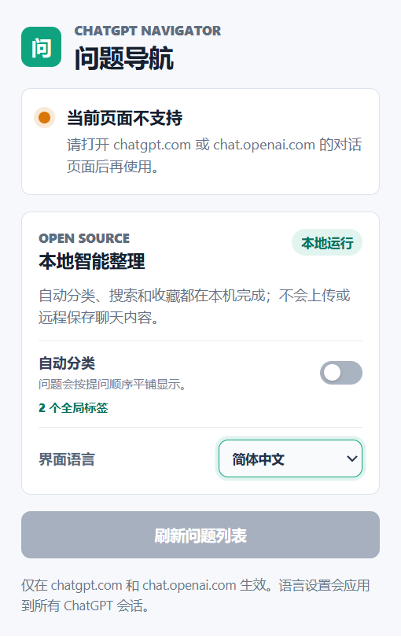
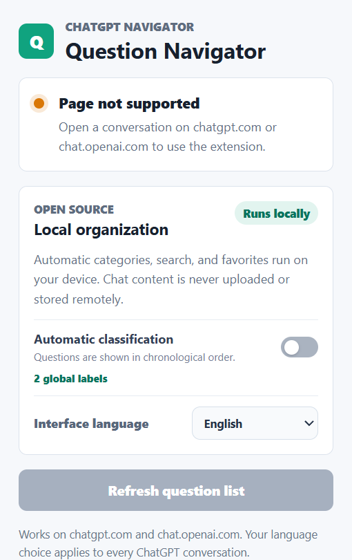
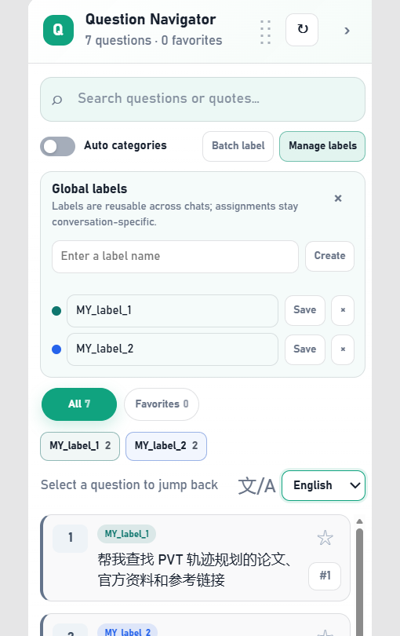
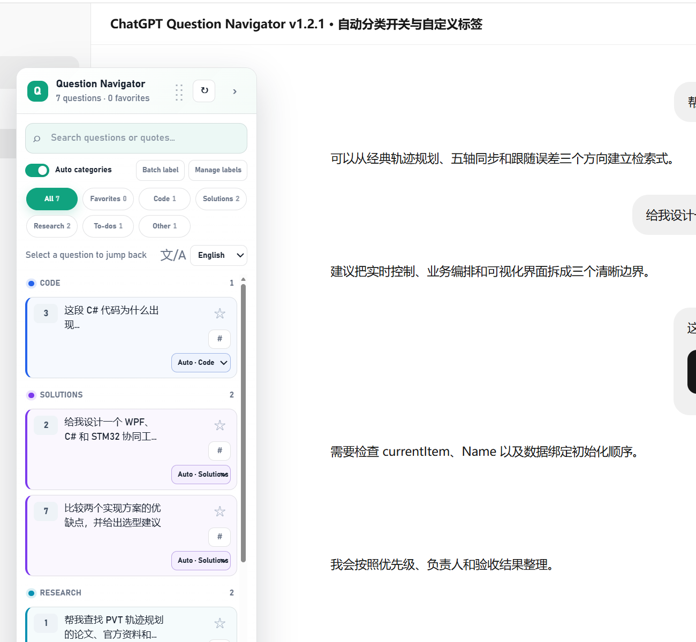

# ChatGPT Question Navigator / ChatGPT 问题导航

## 中文

ChatGPT Question Navigator 是一个本地运行的 Chrome / Edge Manifest V3 浏览器扩展。它会在 ChatGPT 网页端当前对话里生成“问题导航”侧边栏，整理你发出的问题，并支持自动分类开关、搜索、收藏、自定义标签、分类修正和一键跳回原提问位置。

### v1.2.1 更新

- 新增全局自动分类开关；关闭后按原始提问顺序平铺显示。
- 新增可跨对话复用的自定义标签、单题多标签和批量标记。
- 完善中英文界面、搜索、收藏、人工分类及本地隐私存储说明。
- 修复历史问题延迟加载后的顺序、引用摘要裁切，以及标签下拉菜单被后续卡片遮挡的问题。

### 解决的痛点

ChatGPT 网页端的长对话目录并不是每次都会稳定出现。即使对话很长，也可能因为页面结构、窗口宽度、旧聊天加载状态、模型/功能灰度等原因看不到目录。

这个扩展补上一个固定、可控的“我的问题”目录：长聊天复盘、查资料、论文学习、代码讨论、方案修改时，不用反复向上滚动找自己之前问过什么。

## 实际效果

### 更多界面 / More views

展示图采用无损裁剪，突出插件界面；点击图片可查看未经裁剪的完整原图。

  
  

  

中文扩展弹窗 · English popup · 自定义标签管理

## 功能

- 只在 `chatgpt.com` 和 `chat.openai.com` 页面注入脚本。
- 自动列出当前对话中用户发送的问题。
- 在本地自动归入“代码、方案、资料、待办、其他”五个分类。
- 自动分类可全局开启或关闭；关闭后问题按原始提问顺序平铺显示。
- 支持创建、重命名和删除最多 30 个全局自定义标签；一个问题可同时关联多个标签。
- 支持单题快速编辑标签，也可以选择当前结果中的多个问题批量添加或移除标签。
- 自定义标签可跨对话复用，问题与标签的关联仍按会话隔离。
- 支持按问题正文或引用片段实时搜索。
- 支持收藏问题，并在刷新或重新打开同一会话后恢复。
- 支持手动修正分类，也可以随时恢复自动分类。
- 如果问题引用了 ChatGPT 回答中的文字，导航项会一起显示对应引用片段。
- 对“引用文字 + 我不明白 / 什么意思 / 解释一下”这类行内引用问题也会自动拆分显示。
- 点击问题即可跳转到原消息位置，并短暂高亮。
- 支持 ChatGPT 页面动态加载；捕获到新问题后增量追加。
- 右侧悬浮导航栏可拖动、可缩放、可折叠。
- 自动记住导航栏的位置和尺寸，不上传对话内容。
- 支持简体中文和英文；可跟随浏览器语言，也可在面板或扩展弹窗中手动切换。
- GPL-3.0 开源，安装后即可本地使用。

## 安装方式

1. 打开 Chrome 或 Edge。
2. 进入 `chrome://extensions/` 或 `edge://extensions/`。
3. 开启“开发者模式”。
4. 点击“加载已解压的扩展程序”。
5. 选择本项目目录。
6. 打开或刷新 ChatGPT 页面。

## 使用方式

- 打开任意 ChatGPT 对话后，页面右侧会出现“问题导航”。
- 默认“全部”视图会按分类分区；顶部分类按钮可以只看某一类或收藏的问题。
- 使用“自动分类”开关可切换分类分组和时间顺序平铺；该设置会同步到所有 ChatGPT 页面和扩展弹窗。
- 点击“管理标签”可创建、重命名或删除全局标签；点击问题右侧的 `#` 按钮可为单题选择多个标签。
- 点击“批量标记”后可勾选多个问题或全选当前搜索/筛选结果，再统一添加或移除一个标签。
- 当前会话已使用的标签会显示为筛选按钮，并可与搜索和收藏组合使用。
- 在搜索框中输入关键词，可以同时搜索问题和引用片段。
- 点击星标可以收藏；使用问题右侧的分类选择器可以修正分类或恢复自动判断。
- 点击导航栏中的问题即可回到该问题所在位置。
- 按住导航栏标题区域可以拖动位置。
- 拖动右下角斜线手柄可以缩放导航栏大小。
- 点击右上角箭头可以折叠导航栏；折叠后点击圆形“问”按钮或小箭头可以展开。
- 点击扩展图标可以查看连接状态，也可以手动刷新问题列表。
- 使用面板中的语言菜单或扩展弹窗，可以切换“自动 / 简体中文 / English”。语言选择对所有 ChatGPT 会话生效。

## 隐私说明

扩展只读取当前 ChatGPT 页面中已经加载出来的对话内容，用于生成页面内导航。它不请求任何外部接口，不上传你的对话，也不把聊天内容保存到远程服务器。

扩展会在本地保存导航栏的位置和尺寸、自动分类开关、全局标签定义，以及当前会话中问题的收藏、人工分类和标签 ID。持久化内容只包含会话 ID、消息稳定标识、收藏布尔值、分类 ID 和标签 ID，不包含问题正文、引用片段、搜索词或其他聊天文本。

自动分类使用内置的中英文关键词和页面结构信号完成，不调用 OpenAI API，也不需要 API Key。

## 开发与工具

- `manifest.json`：扩展配置和 ChatGPT 页面匹配规则。
- `background.js`：扩展后台消息入口。
- `i18n.js`：简体中文/英文共享词典、语言检测与全局语言偏好。
- `organizer.js`：本地问题分类和搜索匹配逻辑。
- `settings.js`：自动分类开关、全局标签定义、校验和跨页面实时同步。
- `content.js`：注入 ChatGPT 页面，生成问题导航栏并处理整理、存储与跳转。
- `popup.html` / `popup.css` / `popup.js`：扩展弹窗界面。
- `marketing/`：项目展示用页面和素材。
- `tools/license-generator/`：旧授权码格式的开源参考实现，仅用于审计和学习，不包含任何生产签名材料。

## 版权与许可证

Copyright (c) 2026 Xu ZiHan.

本项目采用 GNU General Public License v3.0 授权。你可以按 GPL-3.0 的条款使用、学习、修改和分发本项目。

请保留原作者署名和许可证信息。公开仓库不代表允许他人删除作者信息、冒充原创，或把本项目伪装成自己的独立原创作品。

---

## English

ChatGPT Question Navigator is a local Chrome / Edge Manifest V3 extension. It adds a structured navigator to the current ChatGPT conversation with an automatic-classification switch, search, favorites, reusable custom labels, category corrections, and one-click jump back.

### What's new in v1.2.1

- Adds a global automatic-classification switch with chronological flat mode.
- Adds reusable custom labels, multiple labels per question, and batch labeling.
- Expands bilingual UI, search, favorites, manual categories, and local privacy documentation.
- Fixes delayed-history ordering, quoted-snippet clipping, and label menus being covered by later cards.

### Pain Point

ChatGPT's built-in long-conversation table of contents is not always visible or stable on the web app. A long chat may still have no visible outline because of page structure, viewport width, old conversation loading state, or gradual feature rollout.

This extension adds a consistent local "my questions" navigator for review, research, study, coding discussions, and multi-step planning. You can return to earlier questions without repeatedly scrolling through a long conversation.

### Demo

### Features

- Runs only on `chatgpt.com` and `chat.openai.com`.
- Lists user questions in the current conversation.
- Organizes questions locally into Code, Solutions, Research, To-dos, and Other.
- Lets you switch automatic classification off globally and view questions in chronological order.
- Creates, renames, and deletes up to 30 reusable global labels; each question can use multiple labels.
- Supports both per-question label editing and batch add/remove for selected visible results.
- Reuses label definitions across chats while keeping question assignments conversation-specific.
- Searches question text and quoted snippets in real time.
- Favorites questions and restores them when the same conversation is reopened.
- Lets you correct a category or return to automatic classification.
- Shows quoted snippets when a question references previous assistant text.
- Handles inline quote-and-question patterns.
- Jumps to the original message and highlights it briefly.
- Works with dynamically loaded ChatGPT conversations.
- Supports dragging, resizing, and collapsing the floating panel.
- Persists panel position and size locally.
- Supports Simplified Chinese and English with automatic browser-language detection and a manual override.
- Does not upload or remotely store your chat content.
- GPL-3.0 open source and usable locally after installation.

### Install

1. Open Chrome or Edge.
2. Go to `chrome://extensions/` or `edge://extensions/`.
3. Enable Developer mode.
4. Click "Load unpacked".
5. Select this project folder.
6. Open or refresh ChatGPT.

### Usage

- Open any ChatGPT conversation and the "Question Navigator" panel appears on the page.
- The All view groups questions by category; use the filter chips to focus on favorites or one category.
- Toggle Auto categories from the panel or popup. When disabled, questions remain in their original chronological order.
- Use Manage labels to create, rename, or delete global labels. Use the `#` control on a question to assign multiple labels.
- Enter Batch label mode to select several questions or all visible results, then add or remove one label.
- Labels used in the current conversation appear as filters and combine with search and favorites.
- Use the search field to match both question text and quoted snippets.
- Select the star to favorite a question. Use the category menu to correct or restore automatic classification.
- Click a question to jump back to its original position.
- Drag the panel header to move it.
- Drag the bottom-right handle to resize it.
- Use the arrow button to collapse or expand the panel.
- Click the extension icon to check connection status or refresh the list manually.
- Choose Auto, Simplified Chinese, or English from either the panel or popup. The preference applies across ChatGPT conversations.

### Privacy

The extension only reads the already loaded content in the current ChatGPT page to build an in-page navigator. It does not call an external API, upload your conversations, or save chat text to a remote server.

The extension stores panel layout, the global automatic-classification setting, and global label definitions locally. For each stable ChatGPT conversation it can also store message identifiers, favorite flags, manual category IDs, and label IDs. It never stores question text, quoted snippets, search terms, or other chat content.

Automatic classification uses built-in bilingual rules and page-structure signals. It does not call the OpenAI API and does not require an API key.

### Development

- `manifest.json`: extension manifest and ChatGPT match rules.
- `background.js`: background message entrypoint.
- `i18n.js`: shared Simplified Chinese/English strings, locale detection, and global language preference.
- `organizer.js`: local category classification and search matching.
- `settings.js`: global automatic-classification setting, custom-label validation, and live cross-page synchronization.
- `content.js`: injected into ChatGPT to render the navigator and handle organization, persistence, and jump behavior.
- `popup.html` / `popup.css` / `popup.js`: extension popup UI.
- `marketing/`: project poster and marketing assets.
- `tools/license-generator/`: open reference implementation for the legacy license-token format. It is kept for auditability and does not contain production signing material.

### License

Copyright (c) 2026 Xu ZiHan.

This project is licensed under the GNU General Public License v3.0. You may use, study, modify, and distribute it under the GPL-3.0 terms.

Please keep the original author attribution and license notice. A public repository does not permit removing attribution, impersonating the original author, or presenting this project as someone else's independent original work.
